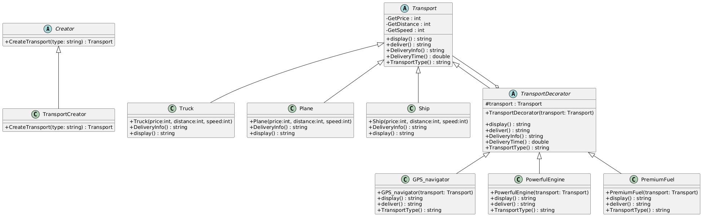

# RGR_Project


Research and Software Development project for the Software Engineering discipline.

Topic: implementation of a cargo delivery program based on the `Factory Method` and `Decorator` design patterns.

## Project Idea

The program models a cargo delivery service that works with several transport types:

- `Truck`
- `Plane`
- `Ship`

Each transport type has its own characteristics:

- delivery cost
- delivery distance
- speed

The transport can also be extended without changing its base class. This is done with decorators:

- `GPS_navigator`
- `PowerfulEngine`
- `PremiumFuel`

As a result, the program demonstrates two design patterns at the same time:

1. `Factory Method` is responsible for creating the required transport type.
2. `Decorator` is responsible for dynamically adding new capabilities to an already created object.

## Implemented Patterns

### 1. Factory Method

The project contains the abstract class `Creator`, which declares the factory method:

```csharp
public abstract class Creator
{
    abstract public Transport CreateTransport(string type);
}
```

The concrete factory `TransportCreator` overrides this method and returns the required transport depending on the input string:

- `"truck"` -> `Truck`
- `"plane"` -> `Plane`
- `"ship"` -> `Ship`

If an unknown type is passed, the factory throws an `ArgumentException`.

The advantage of this approach is that client code does not create objects directly via `new Truck(...)`, `new Plane(...)`, or `new Ship(...)`, but delegates this task to the factory.

### 2. Decorator

The base class `TransportDecorator` inherits from `Transport`, but internally stores a reference to another `Transport` object.

This makes it possible to wrap the base transport with decorators:

```csharp
Transport upgradedTruck =
    new PremiumFuel(
        new PowerfulEngine(
            new GPS_navigator(truck)));
```

As a result, we do not modify the `Truck` class itself, but we get a new object with extended behavior.

## UML Class Diagram

The system architecture is illustrated using a UML class diagram that represents the structural design of the application and demonstrates the interaction between its main components.

The diagram focuses on two key design patterns used in this project:

- **Factory Method** for object creation
- **Decorator** for dynamic extension of transport functionality

The UML diagram provides a visual representation of:
- class hierarchy
- inheritance relationships
- composition (decorator chain)
- overall system structure

This helps to better understand how different parts of the system interact and how the design patterns are applied in practice.

### System Architecture Overview (UML Class Diagram)

Below is the UML class diagram for the project:



## Project Structure

### Main Classes

- `Transport` - abstract base class for all transport types
- `Truck`, `Plane`, `Ship` - concrete transport implementations
- `Creator` - abstract creator
- `TransportCreator` - concrete factory
- `TransportDecorator` - base decorator
- `GPS_navigator`, `PowerfulEngine`, `PremiumFuel` - concrete decorators

### Main Methods

- `display()` - returns the transport name
- `deliver()` - returns delivery information
- `DeliveryTime()` - calculates the estimated delivery time
- `TransportType()` - returns the list of installed upgrades

## Example of Program Behavior

After launch, the program creates:

- a regular truck
- a plane
- a ship
- an upgraded truck with:
  - GPS navigator
  - powerful engine
  - premium fuel

For each object, the program outputs:

- the name
- the delivery description
- the estimated delivery time
- the list of additional equipment

## Tests

The `TestProject1` test project verifies:

1. object creation through `Factory Method`
2. correct behavior of the `Decorator`
3. factory reaction to an unknown transport type

Latest successful result:

```text
Passed! : failed 0, passed 3, skipped 0, total 3
```

## Conclusion

This work demonstrates the combined use of two design patterns:

- `Factory Method` reduces the dependency of client code on concrete transport classes
- `Decorator` makes it possible to flexibly extend object functionality without modifying existing classes
